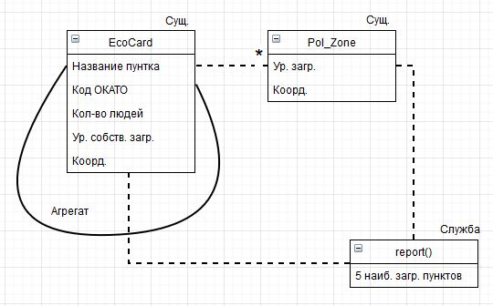

Министерство науки и высшего образования Российской Федерации  
Федеральное государственное бюджетное образовательное учреждение  
высшего образования  
«Московский государственный технический университет  
имени Н.Э. Баумана  
(национальный исследовательский университет)»  
(МГТУ им. Н.Э. Баумана)

---

Кафедра ИУ6  
"Компьютерные системы и сети"

---
Курс: "Современные средства разработки ПО" 

Автор: студент группы ИУ6-54 Емельянов Тимофей Константинович

Лабораторная работа №4. Рефакторинг кода

Предметная область (задача): "Эко карта"

**Цель работы**: Приобрести навыки оценки необходимых изменений при уточнении модели предметной области.

**Объем работы**: 4 часа.

Студенты должны составить план рефакторинга программы после анализа изменений в модели предметной области и выделить сущности, значения, службы и агрегаты.
# Отчет
Вариант:
«Экологическая обстановка» / «Экологическая карточка»	Необходимо определить степень увеличения загрязнения населённых пунктов, которое может произойти из-за выброса ядовитых веществ на предприятии в одном из них. При этом увеличение загрязнения рассчитывается по степени удалённости населённого пункта от эпицентра (обратно квадрату расстояния). Получите отчёт о 5 наиболее загрязнённых населённых пунктах. 
## Модель

Выделенные сущности, службы и агрегат:

## Выводы
Были получены умения по рефакторингу кода и выделению сущностей, ОЗ, служб и аграгата в моделях.

# Документация

Документация создаётся автоматически при обновлении ветки `master` и выкладывается в страницы проекта на GitLab: [сюда](http://lsx.pages.bmstu.codes/msdt-study-group/iu6-5-19/iu6-54b-tkemelyanov/).

